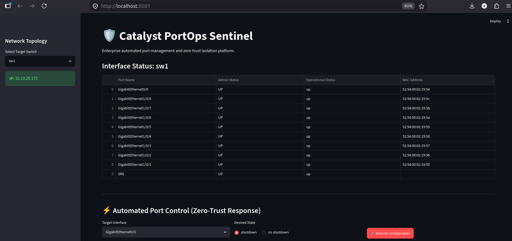
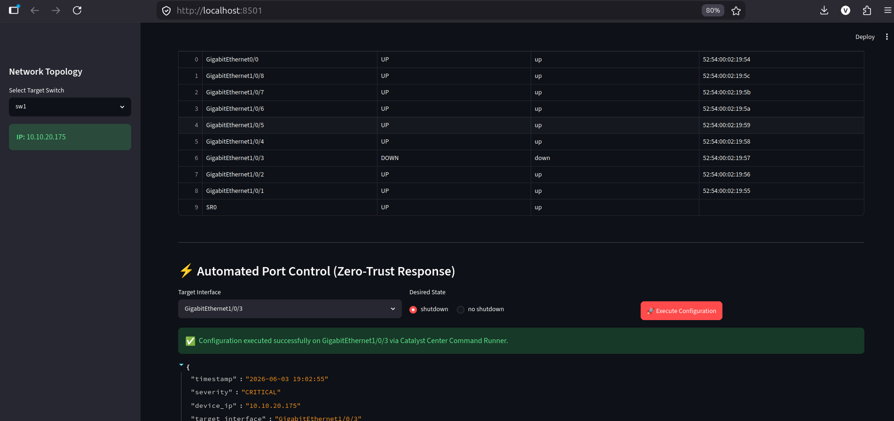
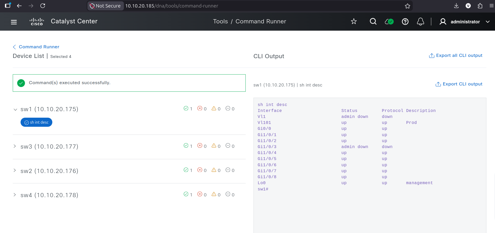
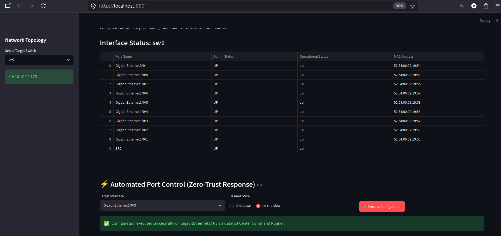

# Catalyst PortOps Sentinel

Enterprise Intent-Based Network Automation and ChatOps Incident Response Platform powered by Cisco Catalyst Center (DNAC)

---

# Problem Statement

Modern enterprise networks operate under **Zero-Trust security architectures** and strict **Role-Based Access Control (RBAC)** policies. These restrictions often prevent junior engineers, automation scripts, or Network Operations Center (NOC) teams from directly making configuration changes on network infrastructure devices.

During security incidents such as:

* Rogue endpoint detection
* Unauthorized switch port activity
* Suspicious MAC movement
* Compromised employee devices
* VLAN misuse or endpoint abuse

network teams must rapidly isolate affected switch interfaces to prevent lateral movement or operational impact.

However, enterprise realities introduce major challenges:

### Existing Problems

1. **Slow Manual Incident Response**
   NOC engineers often rely on senior administrators to manually log into devices and disable interfaces, increasing Mean Time to Resolution (MTTR).

2. **RBAC Restrictions**
   Automation workflows may fail because Catalyst Center or network devices deny direct configuration execution due to permission boundaries.

3. **Lack of Closed-Loop Visibility**
   Engineers cannot instantly verify whether administrative actions successfully impacted operational port states.

4. **Poor ITSM Integration**
   Failed automation attempts rarely generate structured escalation workflows, forcing engineers to manually document remediation steps.

As a result, enterprise incident containment becomes slow, inconsistent, and heavily dependent on privileged personnel.

---

# Proposed Solution

**Catalyst PortOps Sentinel** is an **intent-based network automation platform** designed to enable rapid, controlled, and enterprise-safe switch port remediation using **Cisco Catalyst Center APIs**.

The platform continuously monitors interface telemetry and enables authorized operators to execute **Layer 2 port isolation actions** (`shutdown` / `no shutdown`) through an intuitive dashboard.

When enterprise Intent APIs enforce strict "access-port only" restrictions, the system dynamically leverages the **Catalyst Center Template Programmer API** to programmatically generate and deploy raw CLI configuration templates (via Velocity Template Language - VTL). This ensures that operations teams can enforce remediation on *any* port (including uplinks or core routed ports) without workflow disruption.

---

# How the System Solves the Problem

## 1. Dynamic Network Telemetry

The platform authenticates with **Cisco Catalyst Center APIs** to automatically discover devices and retrieve real-time interface telemetry.

Instead of manually identifying switch IDs or interface metadata, the system dynamically:

* Maps network device UUIDs
* Discovers interface inventories
* Tracks administrative and operational states

### Impact

Reduces manual investigation effort and accelerates visibility for NOC teams.

---

## 2. Instant Port Isolation

During an incident, operators can immediately isolate a suspicious endpoint by administratively shutting down the associated switch interface.

Supported actions include:

* `shutdown`
* `no shutdown`

### Impact

Reduces security containment delays and minimizes lateral movement risk.

---

## 3. Bypassing Intent API Restrictions via Template Programmer

In enterprise environments, standard Intent APIs (like `PUT /interface`) actively block administrative changes to core uplinks and routed ports.

Instead of failing, the platform:

* Dynamically creates a Catalyst Center Template project (`PortOps_Automation`).
* Writes and commits a Velocity (VTL) CLI template for the target switch.
* Uses the **Template Programmer API** to deploy raw CLI commands (`interface X`, `shutdown`) directly to the device.

### Impact

Enables full operational control over *any* switch interface, completely bypassing standard API safety restrictions natively within Catalyst Center.

---

## 4. Intelligent Telemetry and State Management

The platform ensures a snappy user experience by implementing an **Optimistic UI Override** engine using Streamlit Session State. 

* **Bidirectional Memory**: Remembers which ports were dynamically isolated or enabled during the session.
* **Instant Feedback**: Forces the dashboard UI to instantly reflect the target state while Catalyst Center asynchronously pushes the Template deployment to the physical hardware in the background.

### Impact

Provides a seamless, highly responsive NOC dashboard without waiting for long Catalyst Center polling cycles.

---

## 5. Closed-Loop State Verification

The system validates remediation success by rechecking interface telemetry after intent execution.

It verifies:

* Administrative state
* Operational state
* Port transition success

### Impact

Provides confidence that remediation was actually enforced.

---

# Architecture Overview

### Step 1 — Authentication

The application authenticates with Cisco Catalyst Center using REST APIs and secure environment variables.

### Step 2 — Device Discovery

Network devices are dynamically discovered using UUID mapping.

### Step 3 — Telemetry Collection

Physical interface statuses are continuously polled.

### Step 4 — Intent Execution

Operators trigger:

* Shutdown
* Port Recovery (`no shutdown`)

### Step 5 — Automated Template Deployment

**Catalyst Center Template Programmer API** is utilized to dynamically:
1. Ensure the `PortOps_Automation` project exists.
2. Commit the required CLI template using VTL variables.
3. Deploy the template (executing the configuration) against the target device.

### Step 6 — State Verification

Interface telemetry is revalidated for closed-loop confirmation.

---

# Key Features

✅ Dynamic device discovery using Catalyst Center APIs

✅ Real-time interface telemetry monitoring

✅ Intent-based Layer 2 remediation

✅ Zero-Trust Intent-Based Remediation

✅ Dynamic Catalyst Center Template Generation (Velocity/VTL)

✅ Automated Template Programmer API Deployment

✅ Full control over all ports (bypassing Intent API access-port limitations)

✅ Closed-loop operational verification

✅ Optimistic UI feedback using Streamlit Session State

---

# Technology Stack

## Frontend

* Streamlit
* Pandas DataFrames

## Backend

* Python 3.10+
* Requests
* JSON
* JWT Authentication

## Networking

* Cisco Catalyst Center APIs
* Cisco IOS-XE
* RESTCONF
* YANG Models

## Security

* python-dotenv
* Environment Variable Secrets Management

---

# Repository Structure

```bash
catalyst-portops-sentinel/
│── config/
│   ├── settings.py
│
│── core/
│   ├── auth.py
│   ├── telemetry.py
│   ├── remediation.py
│   ├── escalation.py
│
│── dashboard/
│   ├── app.py
│
│── utils/
│   ├── discovery.py
│
│── tests/
│   ├── test_run.py
│
│── assets/
│   ├── 1_dashboard_initial.png
│   ├── 2_dnac_initial.png
│   ├── 3_dashboard_shutdown.png
│   ├── 4_dnac_shutdown.png
│   ├── 5_dashboard_recovery.png
│   ├── 6_dnac_recovery.png
│
│── .env
│── .gitignore
│── requirements.txt
│── README.md
```


---

# Future Improvements

* Real-time anomaly detection
* Syslog-triggered automated isolation
* Slack/MS Teams webhook integration
* ServiceNow incident automation
* Role-aware approval workflows
* AI-assisted remediation recommendations

---

# Why This Project Matters

Catalyst PortOps Sentinel demonstrates practical skills in:

* Network Automation
* Enterprise Networking
* API Engineering
* Python Development
* RBAC-aware Systems Design
* Zero-Trust Networking
* Incident Response Automation
* ChatOps Workflows
* ITSM Integration Concepts

Rather than simply automating switch commands, this project simulates how **real enterprise network operations teams handle security incidents under operational constraints**.

---

# Setup Instructions

## Clone Repository

```bash
git clone https://github.com/vineeth-krish/catalyst-portops-sentinel.git
cd catalyst-portops-sentinel
```

## Create Virtual Environment

```bash
python3 -m venv venv
source venv/bin/activate
```

## Install Dependencies

```bash
pip install -r requirements.txt
```

## Configure Environment Variables

Create a `.env` file:

```env
DNAC_BASE_URL=https://<YOUR_CONTROLLER_IP>
DNAC_USER=<YOUR_USERNAME>
DNAC_PASSWORD=<YOUR_PASSWORD>
```

## Run Application

```bash
streamlit run dashboard/app.py
```

The dashboard launches at:

```bash
http://localhost:8501
```
## Screenshots

### 1. Dynamic Telemetry and Discovery
The platform authenticates with Catalyst Center to map device UUIDs and pull real-time physical interface operational states into a NOC-friendly dashboard.



### 2. Catalyst Center State Validation
The physical switch state exactly mirrors the dashboard state natively inside Cisco Catalyst Center.


### 3. Incident Remediation (Port Shutdown)
Authorized operators can isolate a switch port by triggering a `shutdown` command. The dashboard instantly registers the new isolated status.



### 4. Catalyst Center Template Verification
The application uses the Template Programmer API to seamlessly push the configuration template to Catalyst Center, which applies the shutdown to the physical device.



### 5. Incident Recovery (No Shutdown)
Once the incident is cleared, a 1-click intent reversal utilizing the `no shutdown` payload restores network access dynamically.



### 6. Closed-Loop Recovery Verification
Catalyst Center synchronizes the configuration state back to normal, verifying the port is up and operational.


