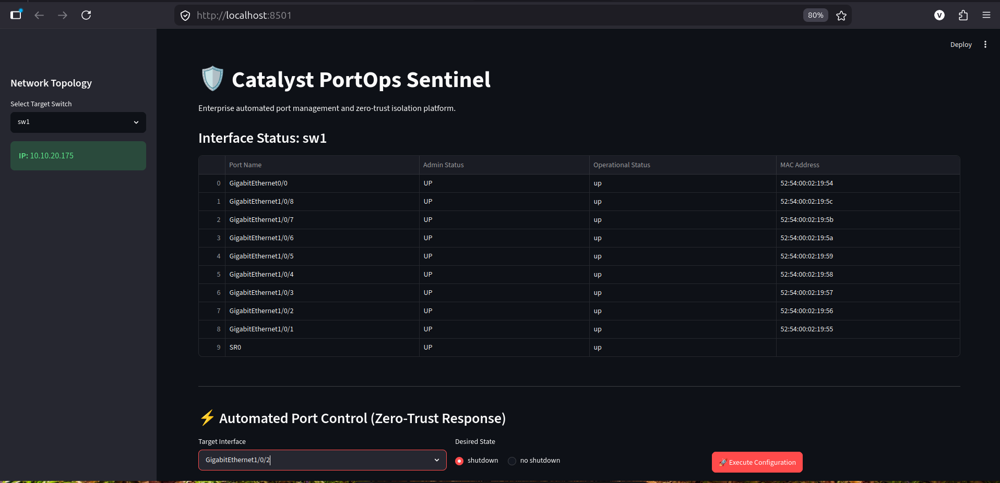
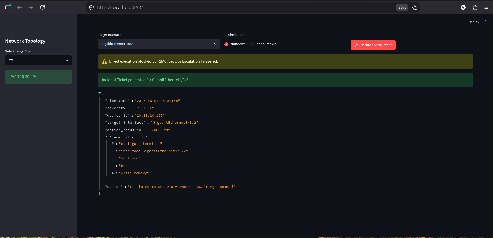
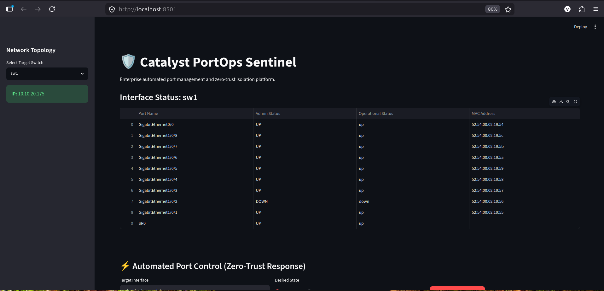
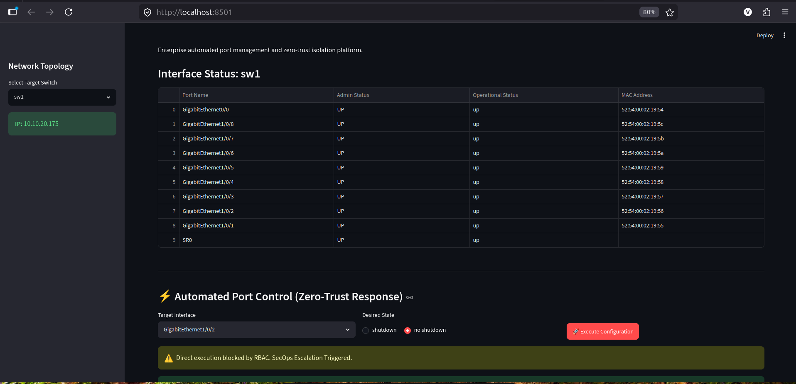

# Catalyst PortOps Sentinel

Enterprise intent-based network automation and ChatOps incident response platform powered by Cisco Catalyst Center (DNAC).

## Project Overview

In modern enterprise networks, Zero-Trust architectures and strict Role-Based Access Control (RBAC) often prevent direct script-based execution on edge devices. Catalyst PortOps Sentinel is a resilient, API-driven Python application designed to bridge the gap between network telemetry and IT Service Management (ITSM). 

It provides Network Operations Center (NOC) teams with a dynamic dashboard to monitor physical interface telemetry and execute automated incident remediation. If direct execution is blocked by enterprise RBAC policies, the system automatically pivots to a ChatOps Escalation Workflow, generating structured JSON remediation payloads for senior engineering approval.

## Key Features

- **Dynamic Network Telemetry:** Integrates with Cisco Catalyst Center REST APIs to auto-discover network devices (UUIDs) and poll real-time physical interface statuses (Admin/Operational).
- **Intent-Based Automation:** Executes Layer 2 interface state changes (`shutdown` / `no shutdown`) to isolate compromised network ports instantly.
- **Intelligent RBAC Handling:** Detects API permission restrictions and prevents application crashes via graceful exception handling.
- **ChatOps Escalation Engine:** Automatically generates structured JSON incident tickets containing the exact IOS-XE/RESTCONF remediation payloads required to resolve the issue, ready for Webhook/ServiceNow integration.
- **Optimistic UI State Management:** Utilizes Streamlit's session state to provide immediate visual feedback on interface status changes prior to controller polling cycles.

## Technology Stack

- **Language:** Python 3.10+
- **Frontend UI:** Streamlit, Pandas (Dataframes)
- **Backend Core:** `requests`, REST APIs, JSON Web Tokens (JWT)
- **Networking Context:** Cisco Catalyst Center (DNA Center) Intent APIs, Cisco IOS-XE, RESTCONF (YANG Models), Layer 2 Forwarding Logic.
- **Security:** `python-dotenv` for strict environment variable secrets management.

---

## Getting Started

### Prerequisites

- Python 3.8 or higher installed on your local machine.
- Access to a Cisco DevNet Catalyst Center Sandbox (or a production DNAC appliance).

### Setup and Installation

Clone the repository, initialize your virtual environment, and install the required dependencies:

    git clone https://github.com/vineeth-krish/catalyst-portops-sentinel.git
    cd catalyst-portops-sentinel
    python3 -m venv venv
    source venv/bin/activate
    pip install streamlit pandas requests python-dotenv urllib3

### Environment Variables

This project requires strict secrets management. Never commit credentials to GitHub. Create a `.env` file in the root directory and add your controller/sandbox credentials:

    DNAC_BASE_URL=https://<YOUR_CONTROLLER_IP>
    DNAC_USER=<YOUR_USERNAME>
    DNAC_PASSWORD=<YOUR_PASSWORD>

### Usage

Run the Streamlit dashboard locally:

    streamlit run dashboard/app.py

The application will launch in your default web browser at `http://localhost:8501`.

---

## Screenshots

### Dynamic Telemetry and Discovery
The platform authenticates with Catalyst Center to map device UUIDs and pull real-time physical interface operational states into a NOC-friendly dashboard.

### Zero-Trust ChatOps Escalation
When direct configuration execution is blocked by lab RBAC policies, the system intercepts the intent and generates a structured JSON remediation ticket for NOC/ITSM approval.

### State Verification (Closed-Loop)
Optimistic UI state verification confirming that the administrative and operational statuses of the targeted port successfully reflect the isolation intent.

### Incident Remediation
1-click intent reversal utilizing the `no shutdown` payload to restore network access once a security incident is cleared.

